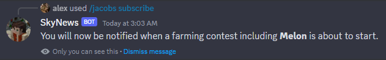

# SkyNews
Yet Another Hypixel Skyblock Bot

## Features
* `/jacobs next` - Let's you know the next three farming contests and when they are.
* `/jacobs subscribe` - Subscribe to be notified for when a certain crop comes up in a farming contest. (not limited to one)
* `/jacobs unsubscribe` - Unsubscribe from a crop notifier.
* 5 minutes before a farming contest it will send a message in the channel that was set up using `/setup`, and if it is a crop you personally subscribed to, will DM you letting you know you have 5 mintues.




Since I made this project in less than a day, it currently only offers Jacob's Farming Contests. I want to and will add more events in the future, I just wanted to get this uploaded to GitHub as soon as possible. If you have any suggestions, feel free to open an issue or pull request.

The `/setup` command is currently a top level command, this will be changed in the future when multiple different categories are available instead of only `/jacobs`.

## How To Use
You can either [download the Discord bot to add to your server](https://discord.com/api/oauth2/authorize?client_id=1116970598019629086&permissions=322624&scope=bot) or, if you want to deploy and run the bot for yourself, you can follow the steps below.

1. [Clone the repository](#cloning-the-repository)
2. [Create a Discord Bot](#creating-a-bot)
3. [Getting a Hypixel API Key](#getting-an-api-key)
4. [Starting the Bot](#starting-the-bot)

### Cloning the Repository
To clone the repository, you can either download the zip folder or use [git](https://git-scm.com/) to clone it. If you are using git, here is the command:
```bash
git clone https://github.com/alexasterisk/skynews.git
```

### Creating a Bot
Creating a Discord bot is a familiar process, you will want to navigate to the [Discord Developer Portal](https://discord.com/developers) and click on "New Application" on the top right. Give your application a name and click "Create". After messing with your bot's settings, you will want to click on "Bot" on the left side and copy the token right below the username. You should put this token in a file called `.env` in the root directory of your project. The file should look like this:
```properties
DISCORD_TOKEN=your_token_here
```
You will want to replace `your_token_here` with the token you copied. **Never share your bot's token with anyone, it is essentially your bot's login details** (think of it like giving someone your email, password, and 2FA code!). Back on the Developer Hub, you will want to also give it some [Gateway Intents](https://discord.com/developers/docs/topics/gateway#gateway-intents). These extend the bot's capabilities. You will want to enable the **Message Content Intent** and, likely in the future, the **Server Members Intent**.

### Getting an API Key
Currently there's nothing in this project that uses the Hypixel API, but this *will* be coming. You can skip this for now, or get it done with so you don't have to worry about it later. **Hypixel updated their API Key system, you will want to go to the [Hypixel Developer Dashboard](https://developer.hypixel.net)** to get an API key for your project.

Once you're on the Hypixel Developer Dashboard, you will want to login and open the dashboard. Once there you will want to click on "Create App" on the top right and select "Personal API Key" not a "Production API Key". You will then need to give it a name and a description and optionally a URL. After clicking continue, you will need to wait a bit to get verified, this took me honestly seconds, so don't worry about this taking forever. Once you're verified, you will be able to see your API key, you will want to copy this and put it in your `.env` file below your Discord token. Your `.env` file should now look like this:
```properties
DISCORD_TOKEN=your_token_here
HYPIXEL_API_KEY=your_api_key_here
```

There is a difference between the Personal API and the Production API, for sole intents and purposes, you should use the Personal API. Unless you're ready to release a large scaled project that needs more than 300 requests per minute, do not use the Production API.

### Starting the Bot
Now that you have setup your bot, you're almost ready to start it. You will want to open a terminal in the root directory of your project and run the following command:
```bash
npm install
```

This will install all of the dependencies needed to run the bot. Once that is done, you can run the bot using:
```bash
npm run deploy
```

This will automatically build and run the bot for you. If you want to use PM2 to run the bot, you can use:
```bash
npm run pm2
```

## Motivation
Honestly I didn't like not being able to easily keep track of Jacob's events, either by constantly checking `/events` or navigating to a website, so I made a bot that is capable of pinging users for what they want to hear. The Jacob's Farming Contest feature is built off of the backbones of [KartoffelChips' Website for tracking Jacob's Farming Contests](https://jacobs.strassburger.org). Here is the [Hypixel thread of their creation](https://hypixel.net/threads/website-jacobs-farming-contests-tracker.5285940/).

## Contributing
If you want to contribute to this project or just want to give me some feedback and ideas, please feel free to open pull requests and issues. I will try to respond to them as soon as possible. You can also contact me on Discord: **alex\*#2348**.

## License
This project is licensed under the [MIT License](https://choosealicense.com/licenses/mit/).

## Acknowledgements
* [KartoffelChips](https://hypixel.net/members/rupert00.3067585/) ([GitHub](https://github.com/KartoffelChipss))
* [Hypixel](https://hypixel.net/)